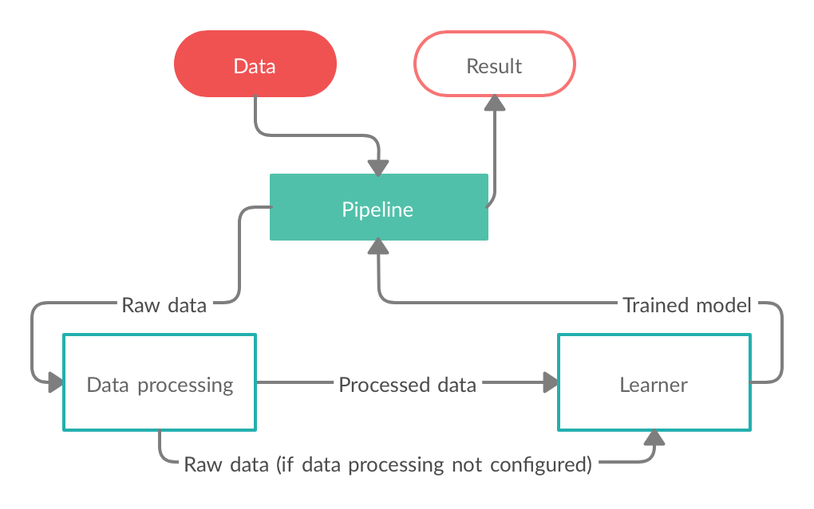

# AutoML
#### An automated Machine Learning pipeline for faster Data Science projects.

Using Evolutionary Algorithms for Neural Architecture Search and State-Of-The-Art data engineering techniques towards building an off the box machine learning solution.

The main usecases:
* Complete Machine Learning flow for small projects.
* Productivity tool for Data Scientists to figure out which model configurations work and which not.
    
    
On a high level, this is how the flow of the Pipeline works:



## Feel free to cite this work

```
@INPROCEEDINGS{9266163,
  author={M. {Anton}},
  booktitle={2020 IEEE 16th International Conference on Intelligent Computer Communication and Processing (ICCP)}, 
  title={Automated Machine Learning using Evolutionary Algorithms}, 
  year={2020},
  volume={},
  number={},
  pages={101-107},
  doi={10.1109/ICCP51029.2020.9266163}}

```


A short GIF presenting the Cloud based solution, available soon:


For usage examples check out the [examples file](Pipeline/examples.py).

